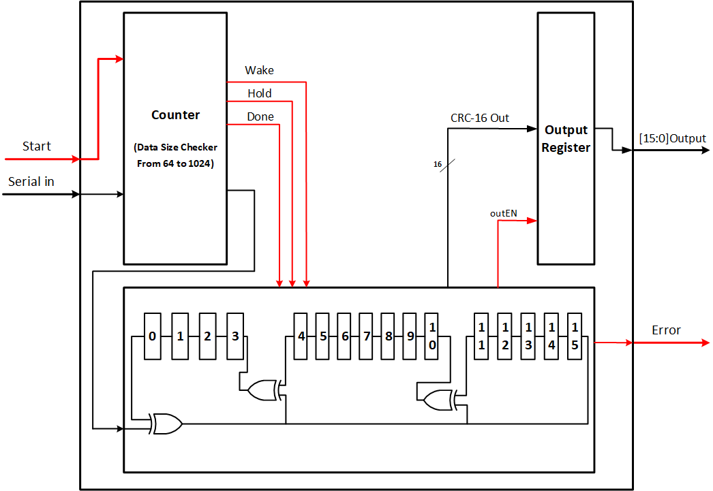

# FCS-16bit
RTL Implementation of FCS Module that has 16-bit ITU-T CRC that's used for error detection using Verilog

# Design

## Note:
For more information, There's a documentation file that's attached to the repo that has an exaplanation for the whole system.